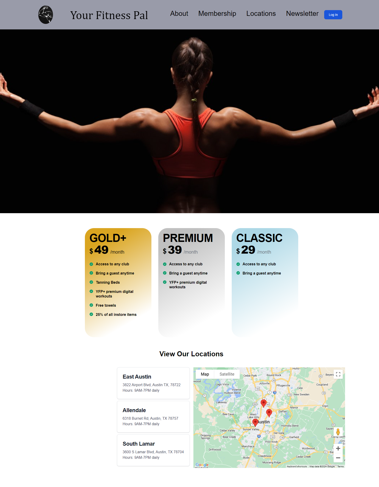

# Your FitnessPal Gym Website

This is a website template for a fictional gym called "Your FitnessPal." The website includes features such as gym membership options, a map to locate the gym, a clickable newsletter, and a login section.

## Table of Contents

- [Description](#description)
- [Features](#features)
- [Usage](#usage)
- [Credits](#credits)
- [License](#license)

## Description

This website template is designed for a gym business to showcase their services and allow users to explore membership options, find gym locations, subscribe to newsletters, and log in to their accounts.

The built application is located at: https://arunmishra11.github.io/Yourfitnesspal/

## Features

- **Membership Options**: The website offers three gym membership options: GOLD+, PREMIUM, and CLASSIC, each with different features and pricing.
- **Map Integration**: Users can view the gym's locations on a map to easily find the nearest branch.
- **Newsletter Subscription**: There is a clickable newsletter section where users can subscribe to receive updates and promotions.
- **Login Section**: Registered users can log in to their accounts using the provided login form.

## Usage

1. Clone the repository to your local machine.
2. Open the HTML files in a web browser to view the website.
3. Customize the content, styles, and functionality to suit your gym business.
4. Deploy the website to a web hosting service if you want to make it accessible online.

## Credits

- **HTML/CSS**: The website layout and styles are created using HTML and CSS.
- **JavaScript Libraries**:
  - Boxicons (https://boxicons.com/)
  - Flowbite (https://flowbite.com/)
  - Google Maps JavaScript API (https://developers.google.com/maps/documentation/javascript/overview)
- **Images**: Images used in the website are for demonstration purposes only and should be replaced with actual gym-related images.
- **Fonts**: Default system fonts and Google Fonts can be customized as needed.

## License

This project is licensed under the [MIT License](https://opensource.org/licenses/MIT) - see the [LICENSE](LICENSE) file for details.
